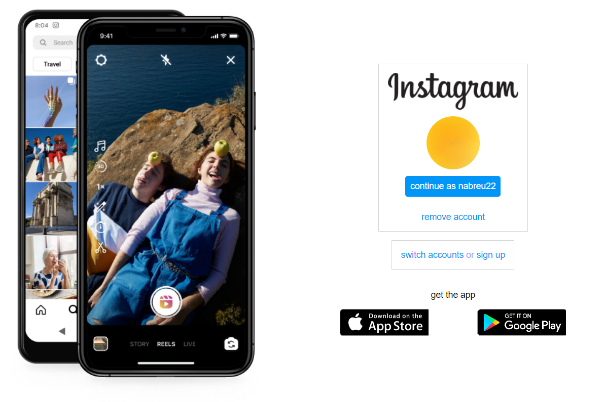

<h1 align="center"> Instagram landing page </h1>

This project is a reconstruction of the instagram landing page made with Html and CSS, using some concepts of Flex Box and responsiveness.  

  <a href="#-technologies">Technologies</a>&nbsp;&nbsp;&nbsp;|&nbsp;&nbsp;&nbsp;
  <a href="#-project">Project</a>&nbsp;&nbsp;&nbsp;
  

  

 

## 🚀 Technologies

This project was developed with the following technologies:

- HTML and CSS
- Javascript
- Git and Github

## 💻 Project

Is a reconstruction of the instagram landing page made with Javascript, Html and CSS, using some concepts of Flex Box and responsiveness.

- [Visit the project online](https://nabreu22.github.io/my-social-media)

---

